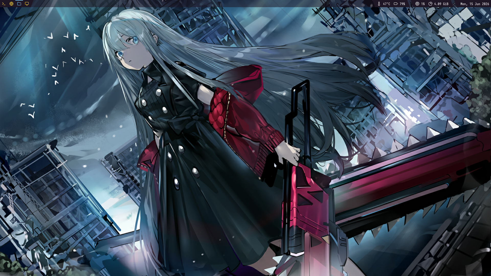
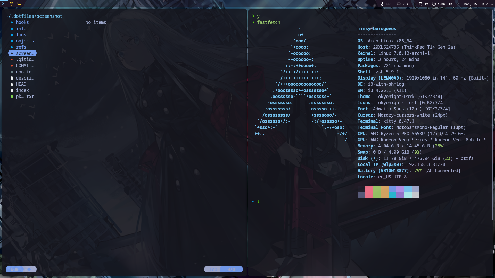

---

## 🖥️ Desktop Environment

* Window Manager: i3
* Terminal: Kitty
* Bar: Polybar
* Launcher: Rofi
* Shell: Zsh + Oh My Zsh + Powerlevel10k
* Notifications: Dunst
* File Manager: Nemo / Yazi
* IME: Fcitx5

---

## 📦 Installed Packages

To reinstall:

```bash
yay -S - < pkglist.txt
```

---

## 📸 Screenshot




---

## ⚙️ Installation

```bash
dotfiles checkout
git clone --bare git@github.com:Aibiles/dotfiles.git $HOME/.dotfiles
alias dotfiles='/usr/bin/git --git-dir="$HOME/.dotfiles/" --work-tree="$HOME"'
dotfiles checkout
dotfiles config --local status.showUntrackedFiles no

```

https://wiki.archlinuxcn.org/wiki/Dotfiles
